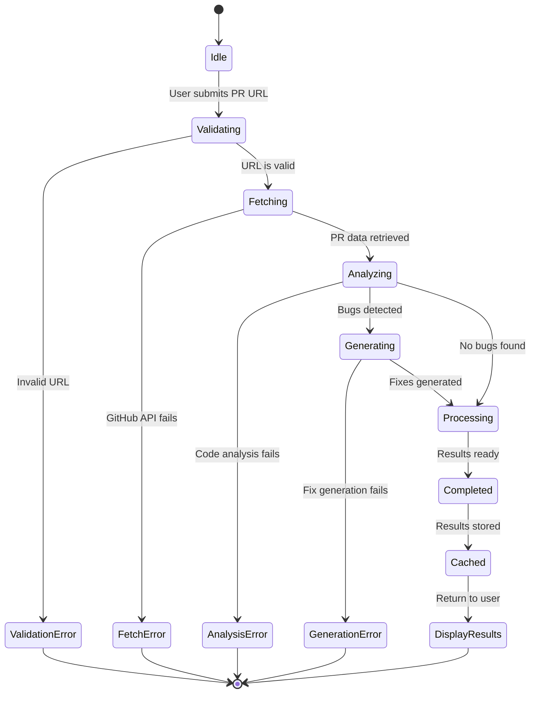
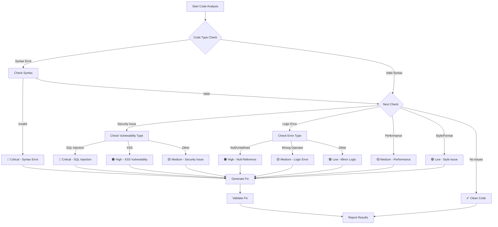
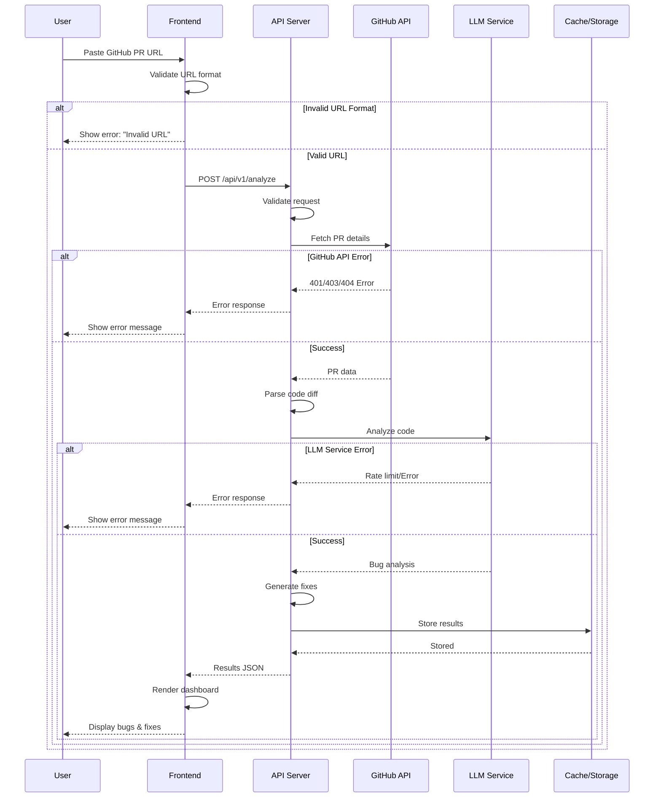
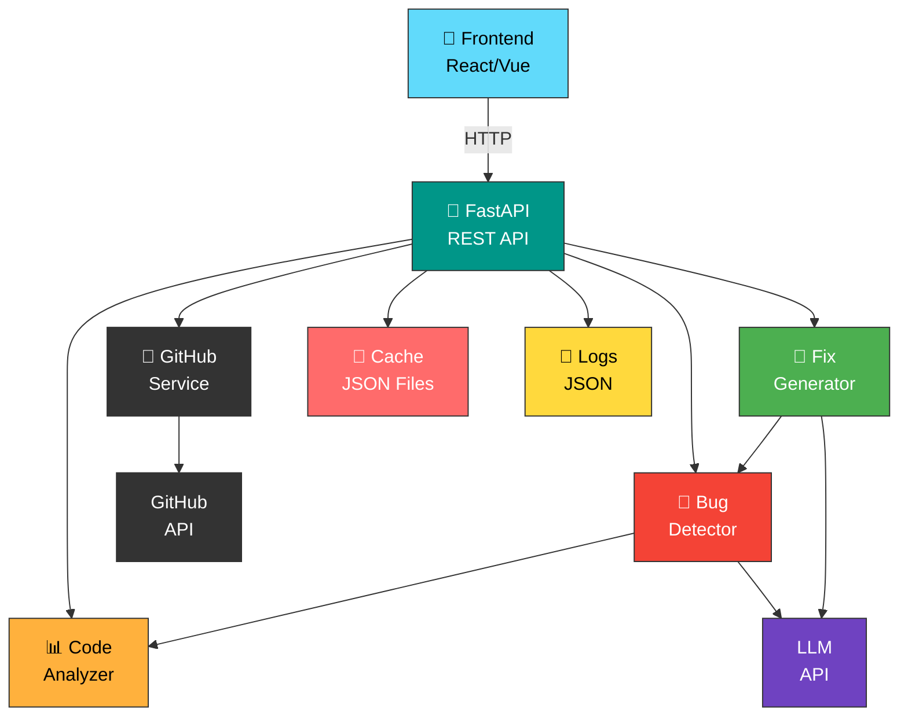
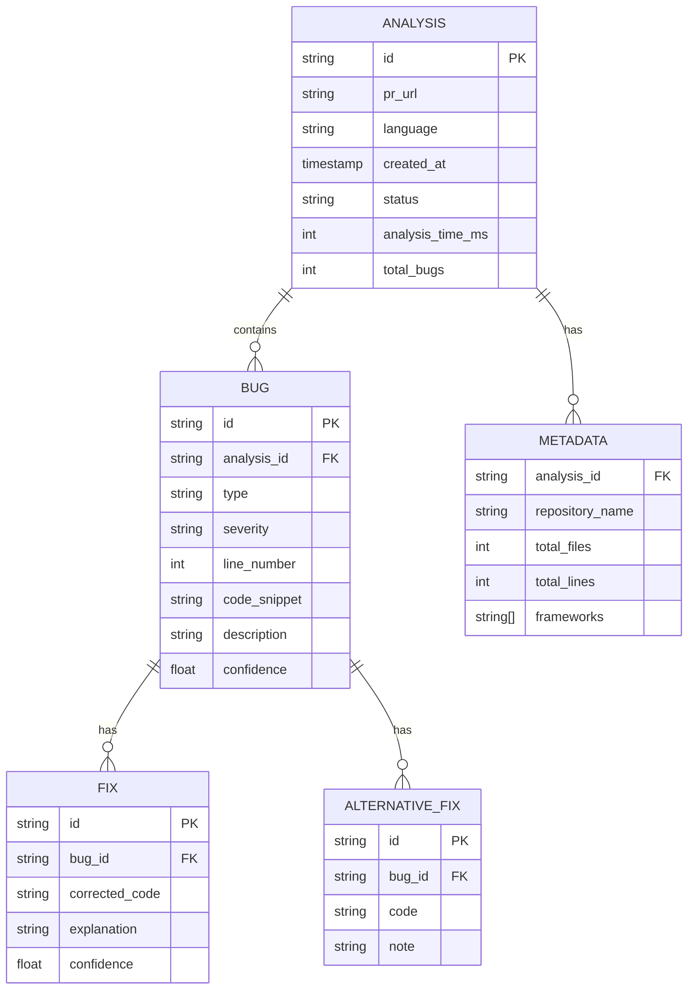

# CodeSurgeon - Sequence Diagrams

## Sequence Diagram 1: PR Analysis Flow

```
User -> Frontend: Enter GitHub PR URL
Frontend -> API: POST /api/v1/analyze (PR URL)
API -> GitHubService: fetch_pr_details(pr_url)
GitHubService -> GitHub API: Get PR files & diff
GitHub API --> GitHubService: PR data
GitHubService --> API: PR content parsed

API -> CodeAnalyzer: analyze_code_structure(pr_code)
CodeAnalyzer --> API: AST & patterns

API -> BugDetector: detect_bugs(code, ast)
BugDetector -> LLM: Analyze code with GPT-4
LLM --> BugDetector: Bug analysis results
BugDetector --> API: List of bugs with severity

API -> FixGenerator: generate_fixes(bugs)
FixGenerator -> LLM: Generate fixes for each bug
LLM --> FixGenerator: Fix suggestions
FixGenerator --> API: Fixes with explanations

API -> Cache: Store analysis results
Cache --> API: Stored

API --> Frontend: Return analysis results (bugs + fixes)
Frontend -> Frontend: Parse and format results
Frontend --> User: Display bugs & fixes dashboard
```

## Sequence Diagram 2: Bug Detail & Fix Generation

```
User -> Frontend: Click on specific bug
Frontend -> API: GET /api/v1/analysis/{id}/bug/{bugId}
API -> Cache: Retrieve analysis from cache
Cache --> API: Analysis data

API -> FixGenerator: generate_detailed_fix(bug)
FixGenerator -> LLM: Generate multiple fix alternatives
LLM --> FixGenerator: Alternative solutions

FixGenerator -> CodeValidator: Validate fixes
CodeValidator --> FixGenerator: Validation results

FixGenerator --> API: Detailed fixes with alternatives
API --> Frontend: Return enriched bug details

Frontend -> Frontend: Render side-by-side comparison
Frontend --> User: Display bug with all fixes & explanations
```

## Sequence Diagram 3: Error Handling Flow

```
User -> Frontend: Submit analysis request
Frontend -> API: POST /api/v1/analyze

alt GitHub API Error
    API -> GitHubService: fetch_pr_details()
    GitHubService -> GitHub API: Request
    GitHub API --> GitHubService: 401 Unauthorized
    GitHubService --> API: GitHubAPIError
    API --> Frontend: HTTP 401 with error message
    Frontend --> User: "Invalid GitHub token"
    
else LLM API Error
    API -> BugDetector: detect_bugs()
    BugDetector -> LLM: Analyze code
    LLM --> BugDetector: Rate limit exceeded
    BugDetector --> API: LLMAnalysisError
    API --> Frontend: HTTP 429 with error message
    Frontend --> User: "Service temporarily unavailable"
    
else Invalid Code
    API -> CodeAnalyzer: analyze()
    CodeAnalyzer -> AST Parser: Parse code
    AST Parser --> CodeAnalyzer: SyntaxError
    CodeAnalyzer --> API: CodeParseError
    API --> Frontend: HTTP 400 with error details
    Frontend --> User: "Invalid code format"
    
else Success
    API --> Frontend: Analysis results
    Frontend --> User: Display results
end
```

## Sequence Diagram 4: Caching & Performance Optimization

```
User -> Frontend: Request analysis for PR URL
Frontend -> API: POST /api/v1/analyze

API -> Cache: Check if PR analysis exists
alt Cache Hit
    Cache --> API: Return cached analysis
    API --> Frontend: Analysis results (from cache)
    Frontend --> User: Display results (instant)
else Cache Miss
    API -> GitHubService: fetch_pr_details()
    GitHubService -> GitHub API: Get PR data
    
    par Parallel Processing
        API -> CodeAnalyzer: Analyze structure
        API -> BugDetector: Detect bugs
        API -> StaticAnalysis: Run static checks
    and
        GitHubService -> GitHub API: Fetch file contents
    end
    
    API -> Cache: Store PR metadata (24h TTL)
    API -> Cache: Store analysis results (1h TTL)
    Cache --> API: Cached
    
    API --> Frontend: Analysis results
    Frontend --> User: Display results
end
```

## Sequence Diagram 5: Multi-User Concurrent Requests

```
User1 -> Frontend1: Submit PR 1 analysis
User2 -> Frontend2: Submit PR 2 analysis

par User1 Request
    Frontend1 -> API: POST /api/v1/analyze (PR1)
    API -> BGTaskQueue: Queue analysis task (PR1)
    BGTaskQueue --> API: Task queued (task_id_1)
    API --> Frontend1: Return task_id_1
    
    BGTaskQueue -> BugDetector: Process PR1
    BugDetector -> LLM: Analyze PR1
    LLM --> BugDetector: Results
    BGTaskQueue -> Cache: Store results
    
and User2 Request
    Frontend2 -> API: POST /api/v1/analyze (PR2)
    API -> BGTaskQueue: Queue analysis task (PR2)
    BGTaskQueue --> API: Task queued (task_id_2)
    API --> Frontend2: Return task_id_2
    
    BGTaskQueue -> BugDetector: Process PR2
    BugDetector -> LLM: Analyze PR2
    LLM --> BugDetector: Results
    BGTaskQueue -> Cache: Store results
end

Frontend1 -> API: GET /api/v1/tasks/task_id_1 (polling)
API -> Cache: Get task status
Cache --> API: Status: completed
API --> Frontend1: Analysis results for PR1

Frontend2 -> API: GET /api/v1/tasks/task_id_2 (polling)
API -> Cache: Get task status
Cache --> API: Status: completed
API --> Frontend2: Analysis results for PR2

Frontend1 --> User1: Display results
Frontend2 --> User2: Display results
```

## Sequence Diagram 6: System Components Interaction

```
┌──────────────────────────────────────────────────────┐
│              Frontend (React)                        │
│  - Components, State, Routing, HTTP Client         │
└────────────────┬─────────────────────────────────────┘
                 │ REST API (HTTP)
                 ↓
┌──────────────────────────────────────────────────────┐
│              FastAPI Backend                         │
│  - Route handlers, Request validation               │
└─────────────┬────────────────────┬──────────────────┘
              │                    │
              ↓                    ↓
      ┌──────────────┐    ┌────────────────┐
      │ GitHub       │    │ LLM Services   │
      │ Integration  │    │ (OpenAI/Claude)│
      └──────────────┘    └────────────────┘
              │
         ┌────┴─────────────┐
         ↓                  ↓
    ┌─────────────┐  ┌──────────────┐
    │ Code        │  │ Bug          │
    │ Analyzer    │  │ Detector     │
    └─────────────┘  └──────────────┘
         │                  │
         └────┬─────────────┘
              ↓
    ┌──────────────────────┐
    │ Fix Generator        │
    └──────────────────────┘
         │
    ┌────┴──────┐
    ↓           ↓
┌────────┐  ┌─────────┐
│ Cache  │  │ Logs    │
│ (JSON) │  │ (JSON)  │
└────────┘  └─────────┘
```

---

## Mermaid Diagram: PR Analysis State Machine



---

## Mermaid Diagram: Bug Classification Flowchart



---

## Mermaid Diagram: API Request Flow with Error Handling



---

## Mermaid Diagram: Component Dependency Graph



---

## Mermaid Diagram: Data Model Relationships



These diagrams provide a comprehensive view of CodeSurgeon's system flow, error handling, and data relationships for the MVP phase.
